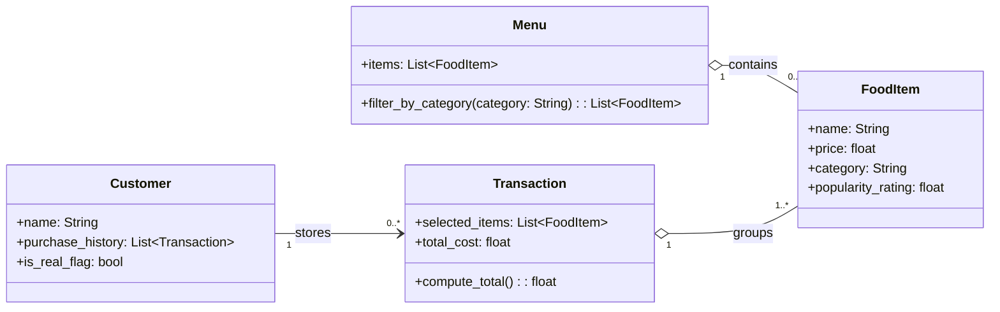

# ByteBites Revised Class Design

This UML-style class diagram reflects the four required backend classes and their core relationships.

## Relationship Notes

- A `Customer` keeps a purchase history made up of zero or more `Transaction` objects.
- A `Menu` manages a collection of `FoodItem` objects and supports category-based filtering.
- A `Transaction` groups one or more `FoodItem` objects.
- `total_cost` is derived from the prices of the `selected_items` in a transaction.